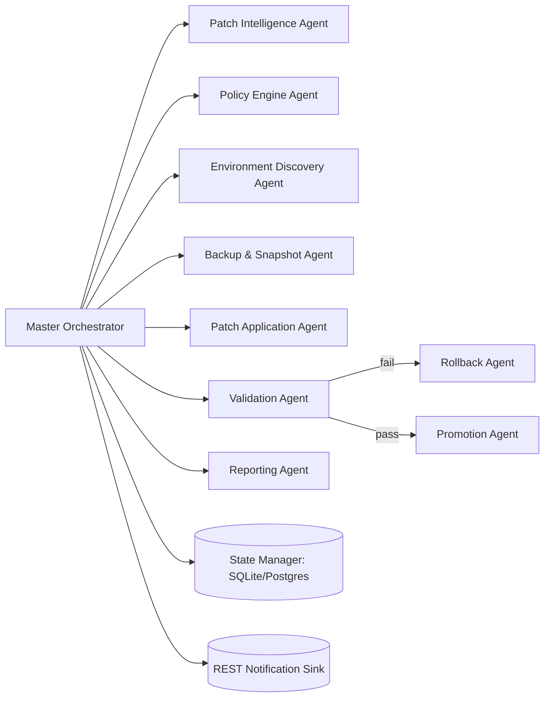
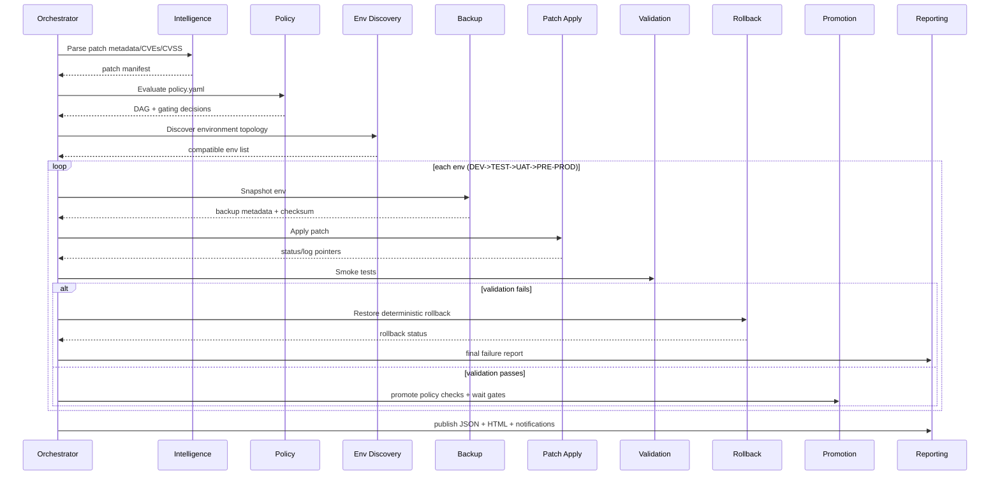

# PeopleSoft Patch Orchestrator

Autonomous, multi-agent framework for quarterly Oracle CPU patching across `DEV -> TEST -> UAT -> PRE-PROD`.

## Capabilities
- Event-driven, policy-based orchestration
- CVSS-aware gating and promotion controls
- Environment discovery and compatibility validation
- Deterministic backup + rollback pipeline
- Idempotent lock-protected execution with checkpoint state in SQLite
- JSON logging, HTML/JSON reporting, and audit export
- Dry-run and simulation modes
- Retry with exponential backoff
- Prometheus metrics-ready hooks

## Architecture



### Execution sequence


## Project layout

```
peoplesoft_patch_orchestrator/
├── agents/
├── core/
├── configs/
├── examples/
├── tests/
├── ansible/
└── logs/
```

## CLI

```bash
python -m peoplesoft_patch_orchestrator.orchestrator --patch-dir=/patches/Jan2026 --auto
python -m peoplesoft_patch_orchestrator.orchestrator --patch-dir=/patches/Jan2026 --dry-run --simulation-mode
python -m peoplesoft_patch_orchestrator.orchestrator --patch-dir=/patches/Jan2026 --compliance-mode
```

---

## End-to-end testing guide (full instructions)

### 1) Prerequisites
- Python 3.11+ (3.10 also works with current scaffold)
- Linux shell (RHEL/OEL compatible)
- Write access to repo `logs/`
- Optional for live patching: Ansible + SSH inventory + OPatch binaries + PeopleSoft runtime
- Note: `configs/*.yaml` currently use JSON-compatible YAML syntax so no external YAML parser dependency is required.

### 2) Validate source tree
Run from repo root:

```bash
python -m py_compile $(rg --files peoplesoft_patch_orchestrator -g '*.py')
```

### 3) Run unit/smoke tests

```bash
python -m unittest discover -s peoplesoft_patch_orchestrator/tests -p 'test_*.py' -v
```

What this validates:
- baseline dry-run succeeds across all environments
- forced validation failure returns non-zero and drives rollback path

### 4) Prepare test patch metadata
A ready sample exists:

```bash
peoplesoft_patch_orchestrator/examples/patches/Jan2026/README.txt
```

You can point `--patch-dir` to this folder for local tests.

### 5) Execute dry-run simulation (recommended first run)

```bash
python -m peoplesoft_patch_orchestrator.orchestrator \
  --patch-dir=peoplesoft_patch_orchestrator/examples/patches/Jan2026 \
  --auto \
  --dry-run \
  --simulation-mode \
  --compliance-mode
```

Expected outcome:
- exit code `0`
- generated files in `peoplesoft_patch_orchestrator/logs/`:
  - `orchestrator.jsonl`
  - `state.db`
  - `graph_<execution_id>.json`
  - `metrics_<execution_id>.prom`
  - `reports/<execution_id>.json`
  - `reports/<execution_id>.html`

### 6) Force-failure scenarios (to test resilience)

#### 6.1 Force patch failure at specific environment
```bash
export PSFT_FORCE_PATCH_FAIL=TEST
python -m peoplesoft_patch_orchestrator.orchestrator \
  --patch-dir=peoplesoft_patch_orchestrator/examples/patches/Jan2026 \
  --auto --dry-run --simulation-mode
unset PSFT_FORCE_PATCH_FAIL
```
Expected: non-zero exit, rollback invoked for TEST.

#### 6.2 Force validation failure
```bash
export PSFT_FORCE_VALIDATION_FAIL=DEV
python -m peoplesoft_patch_orchestrator.orchestrator \
  --patch-dir=peoplesoft_patch_orchestrator/examples/patches/Jan2026 \
  --auto --dry-run --simulation-mode
unset PSFT_FORCE_VALIDATION_FAIL
```
Expected: non-zero exit, rollback invoked for DEV.

### 7) Verify lock behavior (concurrency prevention)
Run one instance and keep it active, then launch a second with same config.
Second run should fail fast with lock conflict and exit code `2`.

### 8) Verify policy gating behavior
Edit `configs/policy.yaml`:
- keep `minimum_severity: ["CRITICAL"]`
- create patch metadata with CVSS `8.0`

Then run without `--auto`: policy should skip execution requiring approval.

### 9) Validate generated artifacts
- `state.db`: query tables `execution_lock`, `events`, `agent_results`
- `graph_*.json`: machine-readable execution graph
- `metrics_*.prom`: Prometheus scrape-compatible counter lines
- `reports/*.json`: final run summary for SIEM or downstream automation

---


## Fastest way to test if everything works
Use the one-command self-test runner:

```bash
bash peoplesoft_patch_orchestrator/scripts/self_test.sh
```

It validates:
- Python compile checks
- Unit/smoke tests
- End-to-end dry-run execution
- Required runtime artifacts (`state.db`, report JSON, metrics, graph)

### Pass criteria
A run is considered healthy when all of the following are true:
1. `self_test.sh` exits with code `0`.
2. `peoplesoft_patch_orchestrator/logs/state.db` exists.
3. `peoplesoft_patch_orchestrator/logs/reports/*.json` exists.
4. `peoplesoft_patch_orchestrator/logs/metrics_*.prom` exists.
5. `peoplesoft_patch_orchestrator/logs/graph_*.json` exists.

### Negative-path validation (required before PROD)
Run these to confirm rollback logic is actually working:

```bash
export PSFT_FORCE_PATCH_FAIL=TEST
python -m peoplesoft_patch_orchestrator.orchestrator \
  --patch-dir=peoplesoft_patch_orchestrator/examples/patches/Jan2026 \
  --auto --dry-run --simulation-mode
unset PSFT_FORCE_PATCH_FAIL
```

```bash
export PSFT_FORCE_VALIDATION_FAIL=DEV
python -m peoplesoft_patch_orchestrator.orchestrator \
  --patch-dir=peoplesoft_patch_orchestrator/examples/patches/Jan2026 \
  --auto --dry-run --simulation-mode
unset PSFT_FORCE_VALIDATION_FAIL
```

Expected for both: non-zero exit + rollback record in `agent_results` table in `state.db`.

## Live environment test progression

1. **DEV only**, dry-run + simulation.
2. **DEV only**, real mode (`--dry-run` off), with forced rollback rehearsal once.
3. **TEST**, real mode after DEV success.
4. **UAT**, real mode + stakeholder approval.
5. **PRE-PROD**, final controlled run in maintenance window.

This progression validates operational readiness before broad rollout.

## Error handling strategy
- Every agent returns `AgentResult(status, details, errors)`.
- `FAILED` in patch/validation triggers rollback agent.
- Locking via SQLite table prevents concurrent patch runs.
- Execution checkpoints persisted in `agent_results`.
- Backoff retries are bounded and jittered.

## Security model
- SHA256 verification for all patch artifacts before apply.
- Immutable JSONL audit log + DB event records (SOX mode).
- No hardcoded credentials; integration points expect secret manager lookups.
- Policy-driven approval gates for non-critical patches.

### Password automation strategy (recommended)
Use external secret orchestration, not interactive prompts:
1. Store credentials in HashiCorp Vault / CyberArk / Oracle Wallet.
2. Use short-lived dynamic credentials via workload identity (OIDC/mTLS).
3. Pass secrets through ephemeral env vars or stdin pipes, never CLI args.
4. For prompt-only utilities, use `expect` as fallback only; prefer silent response files in tmpfs with `0600` permissions and secure deletion.
5. Rotate credentials post-patch and log lease IDs (never raw secrets).


### Critical control: manual password-entry replacement
The framework removes interactive password key-in by using non-interactive secret retrieval at runtime:
- A secret reference (`PSFT_SECRET_REF`) is passed, not secret value.
- Runtime worker retrieves short-lived credential from Vault/CyberArk/Oracle Wallet.
- Secret is fed via stdin/ephemeral response file only in-memory/tmpfs lifecycle.
- Ansible tasks handling credential-bearing args must use `no_log: true`.


### Where to supply passwords when each environment is different
Do **not** place raw passwords in config files. Supply **secret references** per environment using env vars:

```bash
# optional global fallback
export PSFT_SECRET_REF=oracle-wallet://weblogic/admin-default

# per-environment secret refs (recommended)
export PSFT_SECRET_REF_DEV=oracle-wallet://weblogic/admin-dev
export PSFT_SECRET_REF_TEST=oracle-wallet://weblogic/admin-test
export PSFT_SECRET_REF_UAT=oracle-wallet://weblogic/admin-uat
export PSFT_SECRET_REF_PRE_PROD=oracle-wallet://weblogic/admin-preprod
```

You can source these from a local, untracked file:

```bash
set -a
source peoplesoft_patch_orchestrator/configs/secrets.example.env
set +a
```

Resolution order used by the patch agent:
1. `PSFT_SECRET_REF_<ENV>` (e.g., `PSFT_SECRET_REF_DEV`, `PSFT_SECRET_REF_PRE_PROD`)  
2. `PSFT_SECRET_REF` (global fallback)  
3. built-in fallback alias `oracle-wallet://weblogic/admin`

This lets each environment use a different credential set while keeping secrets out of git and logs.

### Critical control: `.resp` cleartext password risk
Handling is implemented as a strict lifecycle control:
1. Create `.resp` only when a tool strictly requires it.
2. File location is tmpfs (`/dev/shm` when available).
3. Permissions are forced to `0600`; execution aborts if not exact.
4. Use file for one patch command only.
5. Overwrite content and delete immediately after command completion.
6. Never persist file path/content in final logs/reports (redacted).
7. Prefer secret reference tokens or wallet aliases in `.resp` over raw passwords when supported.


## Windows Server + SQL Server + Oracle WebLogic profile
This scaffold also supports PeopleTools environments where app/web tiers run on Windows Server and backend is SQL Server.

### Deployment profile specifics
- **Platform**: Windows Server (WinRM managed)
- **Web tier**: Oracle WebLogic on Windows service wrappers
- **App tier**: Tuxedo domain/services on Windows
- **Database**: Microsoft SQL Server
- **Pipeline**: `DEV -> TEST -> UAT -> PRE-PROD`

### Files added for this profile
- `configs/environments_windows_sqlserver.yaml`
- `ansible/apply_patch_windows.yaml`

### How to run against this profile
1. Replace default config for runtime, e.g.:
   - backup existing `configs/environments.yaml`
   - copy `configs/environments_windows_sqlserver.yaml` to `configs/environments.yaml`
2. Run orchestrator in dry-run mode first:
```bash
python -m peoplesoft_patch_orchestrator.orchestrator \
  --patch-dir=peoplesoft_patch_orchestrator/examples/patches/Jan2026 \
  --auto --dry-run --simulation-mode --compliance-mode
```
3. In real mode, use WinRM inventory and `ansible/apply_patch_windows.yaml` for platform tasks.

### Windows/SQL Server validation hooks
- SQL health check in `ValidationAgent` is DB-engine aware and prepared for `sqlcmd` probes.
- `PatchApplicationAgent` is platform-aware and emits Windows-specific step plans.

## Extension guide
- Add new agents under `agents/` implementing `BaseAgent.execute()`.
- Register in `core/orchestrator.py` pipeline.
- Add policy keys in `configs/policy.yaml` and evaluate in `policy_agent.py`.
- For DB/WebLogic CPU patching, add dedicated patch/validation agents and policy stages.
